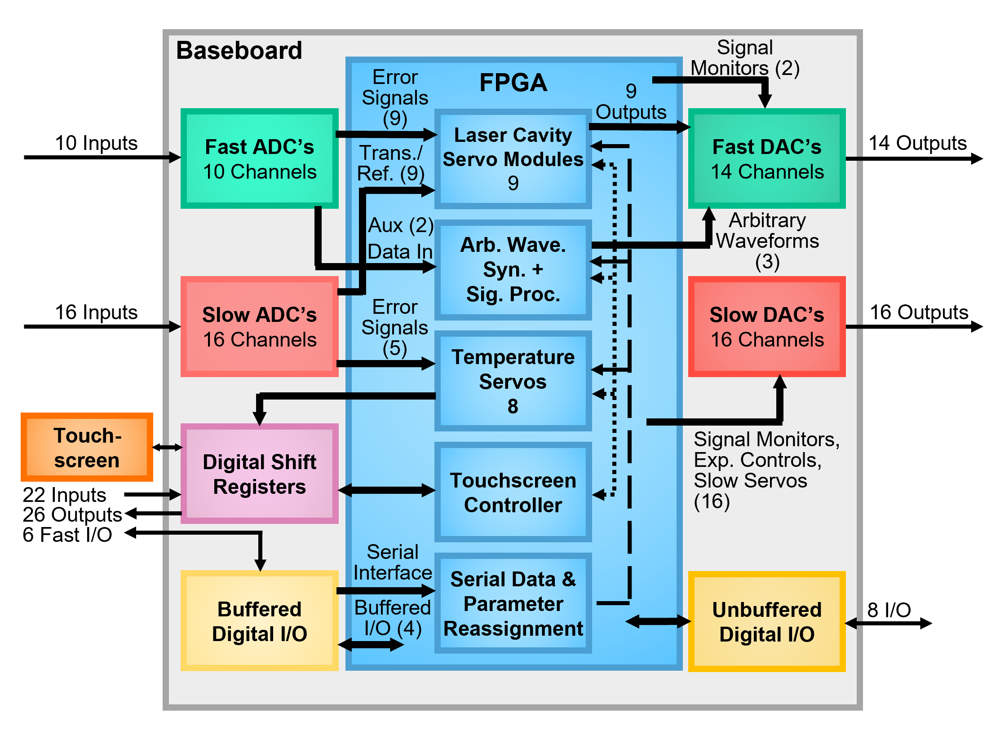

# Many-Channel FPGA Control System

Authors:
Daniel Schussheim and Kurt Gibble (GibbleLab@psu.edu)

Department of Physics

The Pennsylvania State University

This FPGA system is a general-purpose control system with fast and slow analog inputs and outputs and digital inputs and outputs. The baseline configuration implements 9 PID servos with MHz bandwidths and 8 low bandwidth servos, generates 3 arbitrary waveform outputs, and has modulation, lock-in detection, and digital signal processing.  It was developed to frequency stabilize lasers and frequency doubling and summing cavities, stabilize temperatures, and perform a number of controls and signal processing for a cadmium laser-cooling experiment. The developed hardware and firmware for the inputs and outputs can be used for a variety of applications, connecting the system’s inputs and outputs to the provided or user-developed software filters.

The system uses an Enclustra Mercury+ KX2 FPGA module that plugs into a custom baseboard. The Xilinx FPGA is a XC7K160T-2FFG676I, which has 25,350 logic slices, 600 DSP slices and 325 36 kb RAM blocks. Our baseline FPGA software uses 88,576 look up tables distributed over nearly all, 25,196, of the logic slices. Other pin-compatible FPGA modules with more resources are available. The baseboard was designed with Altium Designer Version 21.3.2 (Build 30), and the power supply board was designed in CircuitMaker.

This work builds on a system developed by [NIST](https://github.com/nist-ionstorage/digital-servo), adding more I/O channels, using a larger FPGA, and simplifying filters to allow more servos on a single FPGA. The software is written in Verilog and the bitstreams were generated with Vivado 2020.1.

The supporting files for this many-channel FPGA system (MCFS) are:

* __manual.pdf__: User guide describing the firmware and software, hardware, and assembly of this MCFS.
* __Mercury_AD_Baseboard__: Altium project with the baseboard design files, gerber and drill files (gerber-drill.rar) for printing, and the bill-of-materials (BOM.xlsx) for assembly.
* __Power_Supply__: The power supply board schematics, board layout, gerber and drill files, and bill-of-materials.
* __MCFS_HD__: Vivado Hierarchical Design Project with the Verilog HDL firmware and software and Tcl scripts for generating bitstreams.
* __Serial-parameter-input__: Spreadsheets to adjust the fast and slow servo gains and roll-off frequencies, arbitrary waveform parameters, and to test the fast DAC’s. A Labview program and its executable file are also included.
* __Vivado GUI Projects__: This [page](https://sites.psu.edu/gibble/fpga_gui) has Vivado GUI projects with simplified PID filters that retain 25% gain resolution with combinations of omitting the LSB rounding of the filter cutoff frequencies or have 2n resolution on cutoff frequencies for the proportional or integral filters, or 2n/2 resolution for the differential rolloff with a damping resolution of 2n. These allow timing margin in the full project at 100 MS/s sample rates.

## Schematic of the baseline MCFS software configuration.

## Summary of inputs and outputs

| I/O Type              |      | # of Channels | Sample Rate (MS/s) | Range (V) |
| :---                  | :--- | :---         | :---               | :---      |
| Fast ADC (LTC2194)    | IN   | 10            | 100                | &#xB1;4   |
| Fast DAC (MAX5875)    | OUT  | 14            | 100                | &#xB1;18  |
| Slow ADC (LTC2335-16) | IN   | 16            | Maximum sample rate is 1 channel every &#x3BC;s on each of 2 chips, e.g., 2 ch. @ 1 MS/s or 16 ch. @ 125 kS/s | &#xB1;10 |
| Slow DAC (LTC2666-16) | OUT  | 16 | 0.05 | &#xB1;18  |
| Fast Digital I/O, buffered (TXS0108E-Q1) | IN/OUT | 6             | 100       | 5V digital |
| Fast Digital I/O, unbuffered (FPC connector) | IN/OUT | 8         | 100+      | 3.3V digital |
| Slow Digital In (74LV165A)  | IN  | 22 | 2 | 3.3V digital |
| Slow Digital Out (74VHC595) | OUT | 26 | 19 ch. @ 2 MS/s, 7 ch. @ 3 MS/s | 3.3V digital |
| Display connectors (DB9)| N/A | 2 | N/A | N/A |

## Additional Information

A preprint describing the IIR PID filters, variable duty cycle temperature servos, and more about the system is available on request. 

## Acknowledgements

Financial support to develop this project from the National Science Foundation is gratefully acknowledged.

## License

This work is licensed under a [Creative Commons Attribution-NonCommercial-ShareAlike 3.0 Unported License](https://creativecommons.org/licenses/by-nc-sa/3.0/).
